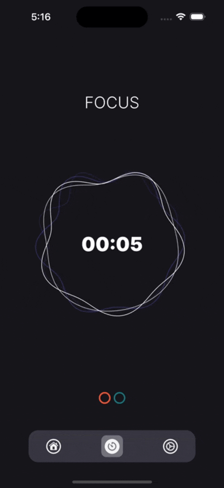

# Modocore pomodoro timer app for IOS

## Description

  

The Modocore app is a productivity tool designed to help users manage their time more effectively and improve their focus and productivity. Inspired by the Pomodoro Technique. The app provides a clean and intuitive user interface, allowing users to start and pause pomodoros with a single tap. It also includes customizable settings. With its minimalist design and seamless functionality app empowers users to maintain a structured workflow, combat distractions, and make the most of their valuable work and study sessions.

App goes beyond being a timer, providing users with a range of valuable features to enhance their productivity. The app offers helpful statistics of tracking pomodoros completed and breaks taken. To further support users in staying focused, the app offers optional sounds or vibration alerts at the end of each pomodoro and break, gently nudging users to shift their attention to the next task or take a moment of rest. 

  
  
  

## Features

- UIKit without Storyboards
- Without 3rd party library
- Custom UIPickerView
- History bar chart
- Custom TabBar